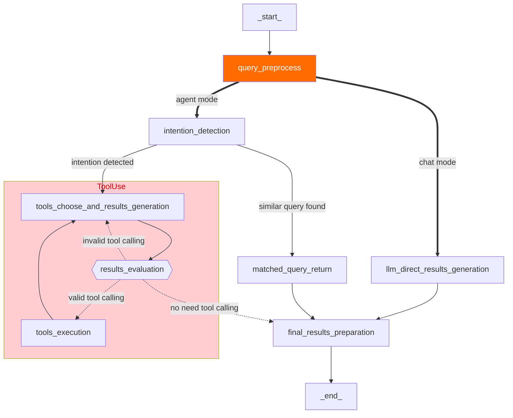

English | [简体中文](README_zh-cn.md)

<div align="center">

# 🎨 <span style="color: #FF6B35">C</span><span style="color: #F7931E">R</span><span style="color: #FFD23F">A</span><span style="color: #06FFA5">F</span><span style="color: #118AB2">T</span>

### ✨ **Conversion, Recognition And Fragmentation Toolkit** ✨

<h3>🚀 Intelligent Document Processing & Agent-Based Applications Platform 🤖</h3>

[](https://github.com/aws-samples/Intelli-Agent/stargazers)
[](https://github.com/aws-samples/Intelli-Agent/actions/workflows/pull-request-lint.yml)
[](https://opensource.org/license/apache-2-0)

---

</div>

<div align="center">

## 🌟 **Welcome to CRAFT** 🌟

*The ultimate toolkit for intelligent document transformation and AI-powered knowledge management*

</div>

### 🎯 **What is CRAFT?**

CRAFT (Conversion, Recognition And Fragmentation Toolkit) is a cutting-edge platform that seamlessly combines intelligent document processing with agent-based conversational AI. Transform your documents into actionable knowledge with unprecedented ease and precision.

### ✨ **Key Features**

🔄 **Smart Document Conversion**
- Automatically converts PDF, DOCX, Excel, CSV, HTML to clean Markdown
- Intelligent image extraction and S3 storage integration
- Preserves document structure and formatting

🧠 **Enterprise Knowledge Base**
- Upload documents in 12+ formats for instant knowledge base creation
- Automatic content processing and vectorization
- Advanced semantic search capabilities

💬 **Interactive Chat Interface**
- Beautiful React/Next.js UI for document management
- Real-time conversational AI interactions
- Multi-language support

🔌 **Comprehensive APIs**
- RESTful APIs for document conversion and chat functionality
- WebSocket support for real-time communication
- Easy integration with existing applications

<div align="center">

### 🚀 **Deploy. Convert. Chat. Repeat.** 🚀

*CRAFT empowers developers to build intelligent, context-aware applications with minimal overhead and maximum efficiency.*

</div>

## 📋 **Table of Contents**

- [🏗️ Architecture](#architecture)
- [⚡ Quick Start](#quick-start)
- [📚 API Reference](#api-reference)
- [❓ FAQ](#faq)
- [🤝 Contribution](#contribution)
- [📜 License](#license)

## 🏗️ **Architecture**
Deploying this solution using the default parameters will build the following environment in Amazon Web Services:


The execution process is as follows:

1. The solution's front-end website is hosted in an Amazon S3 bucket and distributed via Amazon CloudFront. Authentication is provided by an Amazon Cognito user pool.
2. When users upload documents to the knowledge base through the solution's website, the documents are first uploaded to the Amazon S3 bucket.
3. An Amazon Lambda function triggers an Amazon Step Functions workflow to process the file. The document conversion service parses documents and converts them to Markdown format, with intermediate states stored in Amazon DynamoDB and Amazon S3.
4. The conversion process extracts and stores images separately in S3 while maintaining document structure. The Amazon Glue Job vectorizes the segmented text blocks using an Embedding model deployed in an Amazon SageMaker Endpoint and injects them into the vector database Amazon OpenSearch. For documents with images, Amazon Bedrock interprets the images and converts them to text. Finally, Amazon SNS sends the execution result to the user via email.
5. When users send chat messages through the solution's website, the online module's Amazon API Gateway is triggered. Front-end and back-end communication is achieved via WebSocket API. An Amazon Lambda function integrated with Amazon API Gateway sends the request message to Amazon SQS to prevent message timeout.
6. Messages in Amazon SQS are consumed by the online module's Amazon Lambda, which executes Agent/RAG/Chat logic based on the request parameters and records the chat messages in Amazon DynamoDB. The Amazon Lambda function uses intent recognition to determine the necessary tools and perform the corresponding operations.
7. If the RAG model is selected, the Amazon Lambda function vectorizes the query message using the Embedding model deployed in the Amazon SageMaker Endpoint, retrieves matching knowledge from Amazon OpenSearch, reorders the results, and sends the knowledge to the large language model, which then returns the answer to the front end.
8. During the chat, messages between the user and AI are stored in Amazon DynamoDB. The solution's website retrieves a specific chat record through Amazon API Gateway and Amazon Lambda, allowing the user to continue the conversation based on the content of that chat record.

### 🔧 **CRAFT Document Processing Pipeline**
CRAFT's intelligent processing engine provides comprehensive document transformation with format recognition, content extraction to Markdown, image extraction and storage, metadata conversion, and semantic segmentation, all operating seamlessly in the background.


When a large number of content injection requests are received, it can automatically scale out by running multiple Amazon Glue jobs concurrently, ensuring these requests are processed in time.

#### Chunk Metadata
Chunk metadata is defined as below shown:
| Name              | Description                                                                      |
| ----------------- | -------------------------------------------------------------------------------- |
| file_path         | S3 path to store the file                                                        |
| file_type         | File type, eg. pdf, html                                                         |
| content_type      | paragraph: paragraph content                                                     |
| current_heading   | The heading which the chunk belongs to                                           |
| chunk_id          | Unique chunk id                                                                  |
| heading_hierarchy | Heading hierarchy which is used to locate the chunk in the whole file content    |
| title             | The heading of current section                                                   |
| level             | Heading level, eg. H1 is #, H2 is ## in markdown                                 |
| parent            | The chunk id of parent section, eg. H2's parent is its H1, H3's parent is its H2 |
| previous          | The chunk id of previous paragraph at the same Level                             |
| child             | The chunk ids of sub sections                                                    |
| next              | The chunk id of next paragraph at the same Level                                 |
| size              | The number of the chunks when the paragraph is split by a fixed chunk size       |

Here is an example

```
{
	"file_path": "s3://example/intelli-agent-user-guide.pdf",
	"file_type": "pdf",
	"content_type": "paragragh",
	"current_heading": "# Intelli-Agent User Guide WebApp",
	"chunk_id": "$1-4659f607-1",
	"heading_hierarchy": {
		"title": "Intelli-Agent User Guide",
		"level": 1,
		"parent": null,
		"previous": null,
		"child": [
			"$2-038759db",
			"$4-68d6e6ca",
			"$6-e9cdcf68"
		],
		"next": null,
		"size": 2
	}
}

```

### Flexible Mode Options

The whole online logic is implemented using [LangGraph](https://langchain-ai.github.io/langgraph/). The first node is **query_preprocess_lambda** which 
handles the chat history. Then the user can choose from two modes: 
chat and agent. The **chat** mode lets you interact directly 
with different LLMs, such as Anthropic Claude 3. 
The **agent** mode is the most 
complex mode which gives you the possibility to handle complex business 
scenarios. Given the most relevant intention from **intention_detection_lambda** 
and chat history from **query_preprocess_lambda**, **agent_lambda** 
will decide which tools to use and whether the information is enough 
to answer the query. The **parse_tool_calling** node will parse the 
output of **agent_lambda**: 

* **agent_lambda** chooses the wrong tool 
from the perspective of tool format, it will be 
forced to think again through **invalid_tool_calling** edge. 
* **agent_lambda** chooses the valid tool, the tool will be executed 
through **tool_exectue_lambda**. Then, **agent_lambda** will decide 
whether the running results are enough to answer the query.
* There are some cases that **agent_lambda** decides to give the final
response. For cases needing RAG, the **rag_retrieve_lambda** and 
**rag_llm_lambda** will be called. For cases that **agent_lambda** 
needs more information, the **give_rhetorical_question** node will 
be executed. For cases where a constant reply needs to be given, the 
**transfer_reply** and **comfort_reply** will be executed. The 
**give_final_response** means the current results of tool calling 
is enough to answer the query.



## ⚡ **Quick Start**

[](https://aws-gcr-solutions.s3.cn-north-1.amazonaws.com.cn/intelli-agent/videos/intelli-agent-deployment.mp4 "Intelli-Agent Deployment")

Follow these steps to get started:

1. [Prerequisites](#prerequisites)
2. [Deployment](#Deployment)

### 📋 **Prerequisites**

**Step 1**: Install the required dependencies

Execute following commands to install dependencies such as Python, Git, npm, docker and create a service linked role for Amazon OpenSearch service. You can skip this step if they are already installed.
The `setup_env.sh` script is adapted for Amazon Linux 2023. If you are using other operating systems, please manually install these dependencies.


```bash
wget https://raw.githubusercontent.com/aws-samples/Intelli-Agent/dev/source/script/setup_env.sh
sh setup_env.sh
```

**Step 2**: Install the AWS CLI 

Execute the following command to install the AWS CLI if it is not installed.

```bash
curl "https://awscli.amazonaws.com/awscli-exe-linux-x86_64.zip" -o "awscliv2.zip"
unzip awscliv2.zip
sudo ./aws/install
```

You can execute the following command to check the AWS CLI version:

```bash
aws --version
```

### 🚀 **Deployment**

To deploy the solution, follow these steps:

**Step 1**: Clone the GitHub repository

```bash
git clone <repo_url>
```

**Step 2**: Navigate to the deployment directory

```bash
cd Intelli-Agent/deployment
```

**Step 3**: Run the installer script

```bash
# Deploy everything (config + build + deploy)
./installer.sh

# Or run individual steps:
./installer.sh config  # Install dependencies and configure
./installer.sh build   # Build and prepare assets
./installer.sh deploy  # Deploy to AWS
```

During configuration, you will be prompted to enter:

- **Prefix**: A prefix for the solution stack name
- **SubEmail**: The email address to receive notifications
- **KnowledgeBase**: Enable or disable the knowledge base feature
- **KnowledgeBaseType**: Select the type of knowledge base to enable
- **Chat**: Enable or disable the chat feature
- **Connect**: Enable or disable the integration with Amazon Connect
- **Model**: Select the model to use for the solution
- **UI**: Enable or disable the UI feature

**Step 4**: (Optional) Bootstrap AWS CDK on the target account and region

If this is the first time your account is using CDK to deploy resources, please refer to [this document](https://docs.aws.amazon.com/cdk/v2/guide/bootstrapping-env.html) for CDK bootstrap.

```bash
npx cdk bootstrap aws://<Your AWS account ID>/<AWS region>
```

**Step 8**: Confirm the deployment

After deployment, you can find a stack containing `intelli-agent` in the CloudFormation console. On the Output tab of the stack, you can find key solution information, commonly explained as follows:

| Name                     | Description                                                                            |
| ------------------------ | -------------------------------------------------------------------------------------- |
| WebPortalURL             | Link to the Intelli-Agent frontend website.                                            |
| APIEndpointAddress       | RESTful API endpoint address primarily used for data preprocessing, chat history, etc. |
| WebSocketEndpointAddress | WebSocket API endpoint address primarily used for chat functionality.                  |


### 🔄 **Updating an Existing Deployment**

You can update an existing deployment following these steps:

**Step 1**: Navigate to the deployment directory

```bash
cd Intelli-Agent/deployment
```

**Step 2**: Adjust the configuration

Rerun `./installer.sh config`, or modify the config.json located under the `source/infrastructure/bin` directory.

Sample config.json:

```json
{
  "prefix": "",
  "email": "your-email@amazon.com",
  "deployRegion": "us-east-1",
  "knowledgeBase": {
    "enabled": false,
    "knowledgeBaseType": {
      "intelliAgentKb": {
        "enabled": true,
        "email": "support@example.com",
        "vectorStore": {
          "opensearch": {
            "enabled": true,
            "useCustomDomain": false,
            "customDomainEndpoint": ""
          }
        },
        "knowledgeBaseModel": {
          "enabled": true,
          "ecrRepository": "intelli-agent-knowledge-base",
          "ecrImageTag": "latest"
        }
      }
    }
  },
  "chat": {
    "enabled": true,
    "bedrockRegion": "us-east-1",
    "amazonConnect": {
      "enabled": true
    }
  },
  "model": {
    "embeddingsModels": [
      {
        "provider": "sagemaker",
        "name": "bce-embedding-and-bge-reranker",
        "commitId": "43972580a35ceacacd31b95b9f430f695d07dde9",
        "dimensions": 1024,
        "default": true
      }
    ],
    "llms": [
      {
        "provider": "bedrock",
        "name": "anthropic.claude-3-sonnet-20240229-v1:0"
      }
    ],
    "modelConfig": {
      "modelAssetsBucket": "intelli-agent-models-078604973627-us-west-2"
    }
  },
  "ui": {
    "enabled": true
  },
  "federatedAuth": {
    "enabled": true,
    "provider": {
      "cognito": {
        "enabled": true
      },
      "authing": {
        "enabled": false
      }
    }
  }
}
```

**Step 3**: Update the deployment

```bash
# Update everything
./installer.sh

# Or update specific components:
./installer.sh build   # Rebuild assets only
./installer.sh deploy  # Deploy changes only
```

### 🗑️ **Uninstalling the Solution**

To uninstall the solution, follow these steps:

1. Log in to the AWS Management Console and navigate to the CloudFormation page.
2. Select the stack that contains the keyword `intelli-agent`.
3. Click on the Delete button to initiate the deletion process.


## 🌟 **Feature Overview**


### 💬 **1. Chat Window**
The chat area consists of two main functionalities: Chatbot and History.
The Chatbot can initiate a new conversation based on supported LLM models.
History -> The chat history ID that needs to be restarted will display past chat records on the page. Users can continue their conversation based on it.


### 📚 **2. CRAFT Document Conversion & Library**
The Document Library provides intelligent document conversion and management capabilities:
- **Supported Formats**: PDF, DOCX, Excel (XLS/XLSX), CSV, HTML, TXT, MD, JSON, JSONL, and image formats (PNG, JPG, JPEG, WEBP)
- **Automatic Conversion**: Documents are automatically converted to Markdown format with preserved structure
- **Image Extraction**: Embedded images and image links are automatically extracted and stored separately
- **UI Upload Limit**: 10MB per document
- **Batch Operations**: Single upload, multiple deletion support

Tips:
- Duplicate document names will be overwritten with the latest version
- Upload Process: Document upload → Conversion to Markdown → Image extraction → Offline processing
- Status shows "Completed" only after both conversion and processing are finished
- Converted Markdown files and extracted images are stored in S3 with organized structure
- Example:


### 👤 **3. User Management**
The current username is displayed in the upper right corner. Click "Logout" to log out.

### 🌐 **4. Multi-Language Support**
Currently supports Simplified Chinese and English.


## 📚 **API Reference**
After CDK deployment, you can use HTTP clients such as Postman/cURL to invoke the APIs. The platform provides comprehensive APIs for document conversion and chat functionality:

### 🔄 **CRAFT Document Conversion API**
- **Endpoint**: `/process`
- **Method**: POST
- **Purpose**: Convert documents (PDF, DOCX, Excel, CSV, HTML) to Markdown with automatic image extraction
- **Input**: S3 bucket and object key of source document
- **Output**: Converted Markdown file location and extracted image locations in S3

### 🔗 **Additional APIs**
- [LLM API Schema](https://github.com/aws-samples/Intelli-Agent/blob/main/docs/LLM_API_SCHEMA.md): Send questions to LLM and get responses
- [ETL API Schema](https://github.com/aws-samples/Intelli-Agent/blob/main/docs/ETL_API_SCHEMA.md): Upload knowledge to the vector database
- [AOS API Schema](https://github.com/aws-samples/Intelli-Agent/blob/main/docs/AOS_API_SCHEMA.md): Search data in the vector database

For detailed API specifications, refer to the OpenAPI documentation in `source/infrastructure/api/openapi.json`.


## ❓ **FAQ**

### How to Get Support
Get support by creating an issue on GitHub.

### After Deployment, How to Get Initial Username and Password
During CDK deployment, you specified the SubEmail parameter, which is the email address used for receiving notifications. After a successful CDK deployment, the initial username and password will be sent to this email.

### 🔄 **CRAFT Document Conversion Process**
CRAFT processes documents through an intelligent 7-step pipeline:

1. 🔍 **Format Detection**: Automatically identifies document type (PDF, DOCX, Excel, CSV, HTML)
2. 📝 **Content Extraction**: Converts document content to clean Markdown format
3. 🖼️ **Image Processing**: Extracts embedded images and image links, stores them separately in S3
4. ✂️ **Document Segmentation**: Splits Markdown content based on paragraphs and structure
5. 🎯 **Token Management**: Further splits content if paragraphs exceed the maximum token limit (default: 500, customizable)
6. 💾 **Storage**: Stores converted Markdown files and extracted images in S3 with proper metadata
7. 🧠 **Vectorization**: Processes text blocks for vector database injection

✨ All converted documents maintain their original structure while being optimized for search and retrieval.

To inject intent data into your system, follow these steps:


## 🧪 **Testing**
For detailed test information, please refer to the [Test Documentation](https://github.com/aws-samples/Intelli-Agent/blob/dev/tests/README.md)

## 💰 **Cost**
See [COST](COST.md) for detailed pricing information.

## 🤝 **Contribution**
We welcome contributions! See [CONTRIBUTING](CONTRIBUTING.md#security-issue-notifications) for more information.

## 📜 **License**
This project is licensed under the Apache-2.0 License.

---

<div align="center">

### 🎨 **Built with CRAFT** 🎨

*Transform your documents. Empower your knowledge. Accelerate your AI.*

**[⭐ Star us on GitHub](https://github.com/aws-samples/Intelli-Agent) | [📖 Documentation](docs/) | [🐛 Report Issues](https://github.com/aws-samples/Intelli-Agent/issues)**

</div>
